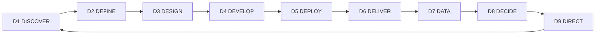

# Архитектура методологии 9D

## Цикл валидации

Методология 9D организована в виде цикла валидации, где каждый D-блок последовательно проверяет и усиливает предыдущие:

## Параллельная обработка

Несмотря на последовательный цикл валидации, все D-блоки активны одновременно:

- **Параллельное функционирование**: Все измерения работают одновременно
- **Взаимное влияние**: Изменения в одном D-блоке немедленно влияют на другие
- **Системное равновесие**: Оптимальное состояние достигается при балансе всех D-блоков

## Система раннего обнаружения

9D включает встроенную систему раннего обнаружения проблем:

- **Триггеры**: Каждый D-блок содержит индикаторы, сигнализирующие о потенциальных проблемах
- **Раннее выявление**: Проблемы обнаруживаются до того, как они становятся критическими
- **Проактивное решение**: Методология предлагает конкретные действия для устранения проблем

## Петли обратной связи

Архитектура 9D построена на непрерывных петлях обратной связи:

- **Внутри D-блоков**: Каждый блок имеет внутренние механизмы валидации
- **Между D-блоками**: Результаты одного блока валидируются другими блоками
- **Внешняя валидация**: Рыночные результаты обеспечивают окончательную проверку

## Снижение рисков

Методология 9D систематически снижает риски продуктовой разработки:

- **Идентификация рисков**: Каждый D-блок выявляет специфические риски
- **Оценка рисков**: Количественные и качественные методы оценки
- **Смягчение рисков**: Конкретные стратегии для каждого типа риска
- **Мониторинг рисков**: Непрерывное отслеживание и переоценка
